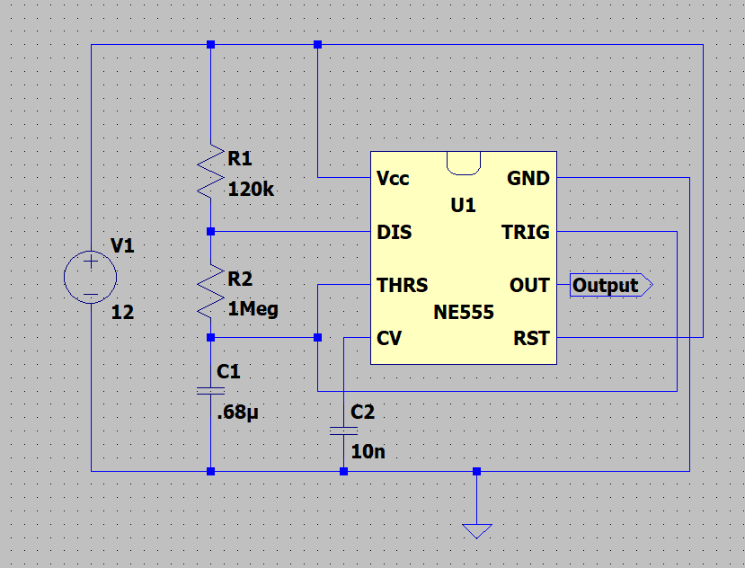

# 12V 555 Timer Astable Multivibrator (1Hz)

This project features a simple 555 timer-based astable multivibrator circuit operating at approximately **1Hz** using a **12V DC supply**.  
It was designed in **KiCad** and simulated using **LTspice**.

---

## 📂 Project Files
| File Name                | Description                      |
|--------------------------|----------------------------------|
| `555_Timer.asc`          | LTspice simulation schematic     |
| `555_timer.kicad_sch`    | KiCad schematic design           |
| `555_timer.kicad_pcb`    | KiCad PCB layout                 |

---

## ⚡ Key Features
- **Operating Voltage:** 12V DC
- **Frequency Output:** ~1Hz square wave
- **Core Component:** NE555 Timer IC
- **Stable astable multivibrator operation**
- Suitable for basic timing, blinking LEDs, or low-frequency pulsing.

---

## 🛠️ Tools Used
- **LTspice**: for circuit simulation and waveform analysis
- **KiCad**: for schematic capture and PCB design

---

## 🧠 Design Notes
- The resistor and capacitor values were selected to achieve a 1-second ON and OFF cycle.
- Special attention was given to maintaining frequency stability over supply voltage variations.
- PCB designed for easy assembly and testing.

---

## 📷 Screenshots

### Schematic

### PCB Layout

### 3D View

### 3D View (Back Side)

